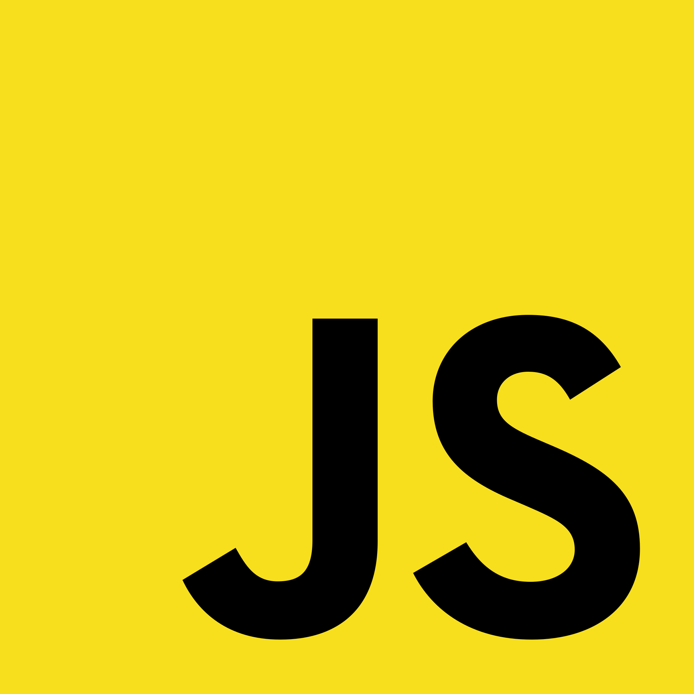
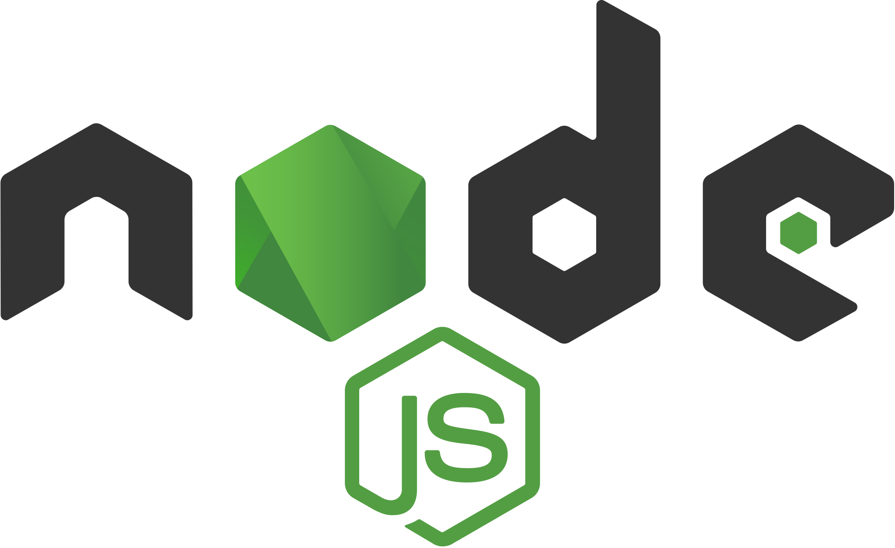
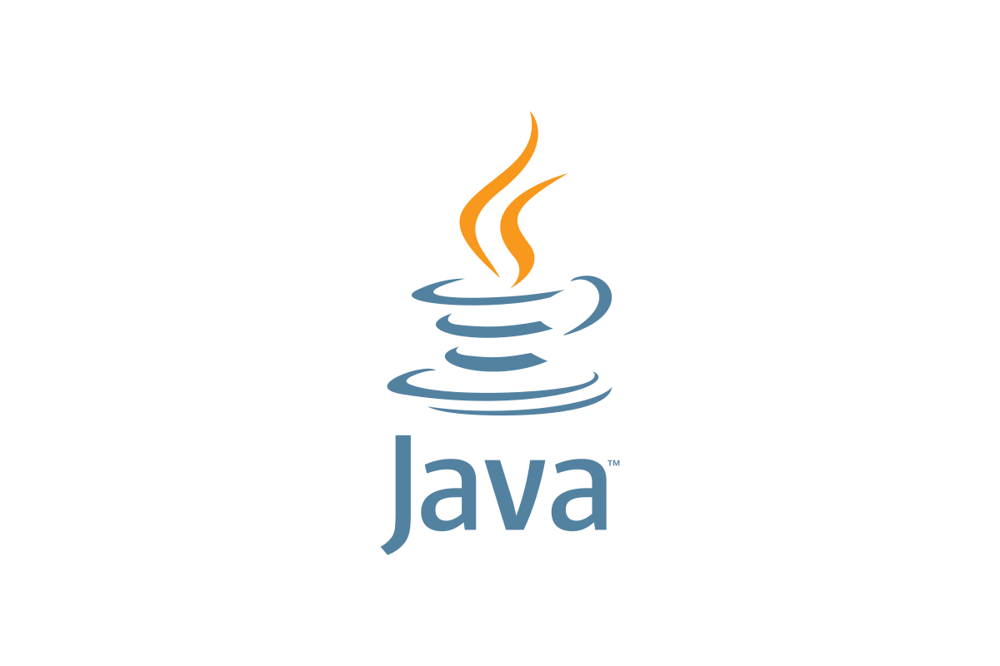
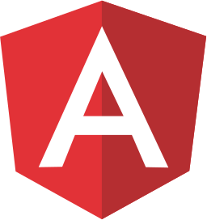
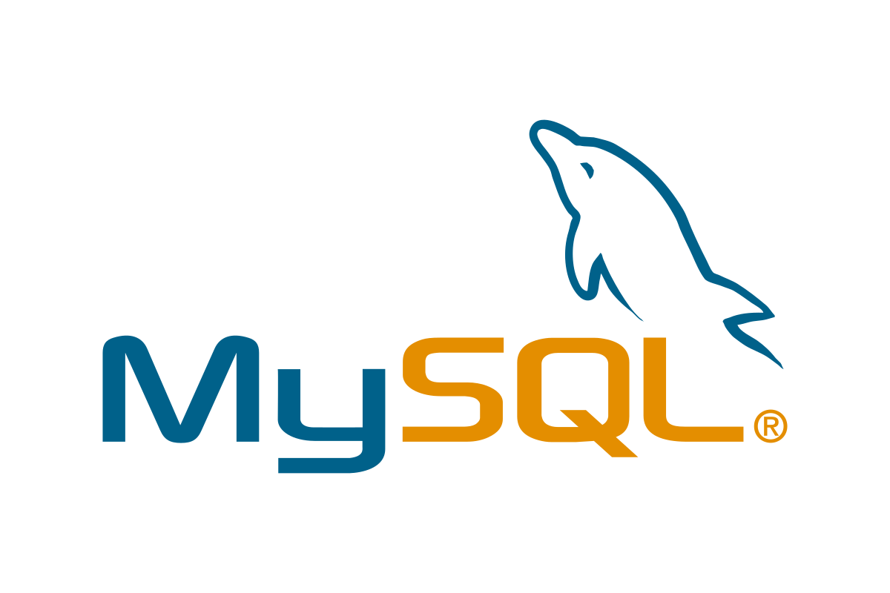

# 👋 Bienvenue sur mon GitHub !

## Qui suis-je ?

🚀 A la recherche de mon premier CDI!

Passionné par la technologie dès mon plus jeune âge, j'ai toujours été fasciné par les ordinateurs, les jeux vidéo et tout ce qui touche au numérique. Il y a quelques années, j'ai décidé d'entreprendre une reconversion professionnelle dans le domaine du développement web.

Au cours de cette transition, j'ai suivi plusieurs formations pour acquérir les compétences nécessaires. J'ai débuté avec une formation chez OpenClassroom, où j'ai découvert et pratiqué les bases du développement web. Par la suite, j'ai approfondi mes connaissances en suivant une formation chez M2i sur le langage Java, élargissant ainsi mes compétences tant en frontend qu'en backend.

Aujourd'hui, je suis actuellement en formation Concepteur Développeur d'Applications (bac+4) jusqu'en mai 2025. Pendant cette période, j'ai réalisé un stage du 6 janvier 2025 au 04 avril 2025 chez Eurekam. Cette opportunité ma permis de travailler sur des cas concrets et de commencer à forger une expérience terrain solide.

Je suis enthousiaste à l'idée de poursuivre la mise en pratique de mes compétences, d'apprendre de nouvelles technologies et de contribuer à vos projets.

✅Curiosité
✅Détermination
✅Empathie 
 
🎯Objectif: Cdi Juillet 2025

## Mes compétences 💻

   

   

 

 

## Mon profil Linkedin 
[https://www.linkedin.com/in/florianmarchive/](url)
